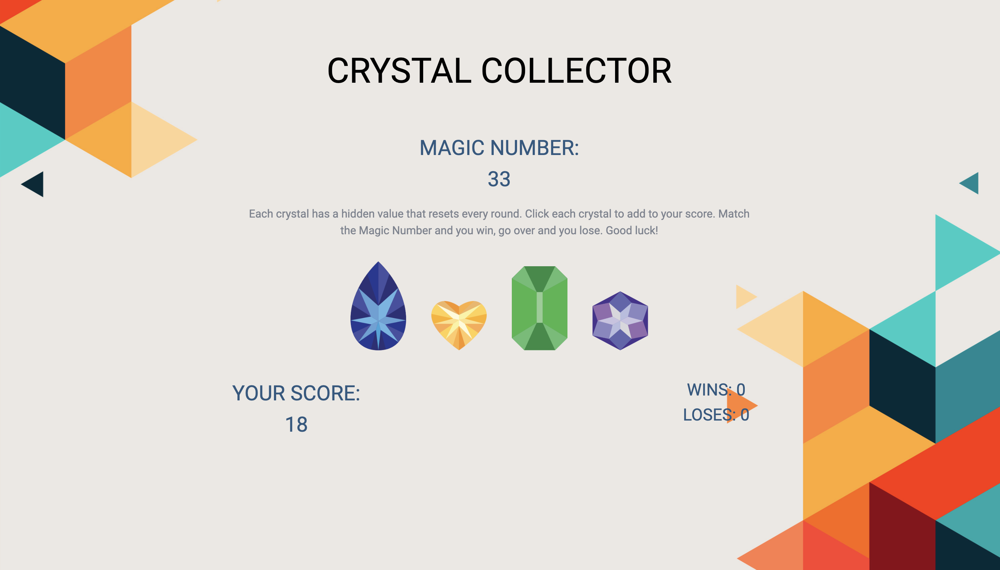

# Crystal Collector

## Description

This is fully mobile resposive logic game written in JavaScript using some jQuery. Each crystal is assigned a hidden value for each round that adds to your score when clicked. The object is to match the Magic Number by clicking the crystals. Match the Magic Number, you win and hear a sound. Go over the Magic Number and you lose and hear a sound.

### Mobile View

### Desktop View

